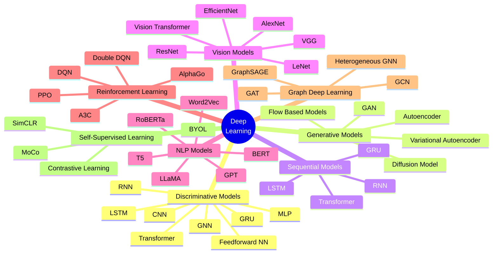
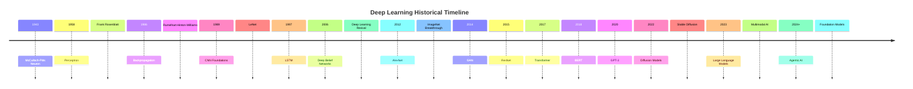

# **`Awesome`** Deep Learning ([DL](https://wikipedia.org/wiki/Deep_learning)) 

    
    &nbsp;
    
    &nbsp;
    
    

## 📖 Contents
- [Types of Deep Learning](#types-of-deep-learning)
    - 1. [Convolutional Neural Networks](#1-convolutional-neural-networks-cnns)
    - 2. [Recurrent Neural Networks](2-recurrent-neural-networks-rnns)
    - 3. [Long Short-Term Memory Networks](#3-long-short-term-memory-networks-lstms)
    - 4. [Generative Adversarial Networks](#4-generative-adversarial-networks-gans)
    - 5. [Autoencoder](#5-autoencoders)
- [My Awesome Lists](#my-awesome-lists)
- [Contributing](#contributing)
- [Contributors](#contributors)

## Types of Deep Learning

```mermaid
graph TD
    A[Deep Learning]

    A --> B[Architectures]
    A --> C[Learning Paradigms]
    A --> D[Optimization]
    A --> E[Applications]

    %% Architectures
    B --> B1[Feedforward Neural Networks]
    B --> B2[CNN]
    B --> B3[RNN]
    B --> B4[LSTM / GRU]
    B --> B5[Transformer]
    B --> B6[GNN]
    B --> B7[Autoencoder]
    B --> B8[GAN]
    B --> B9[Diffusion Models]

    %% Learning
    C --> C1[Supervised Learning]
    C --> C2[Unsupervised Learning]
    C --> C3[Semi-Supervised Learning]
    C --> C4[Self-Supervised Learning]
    C --> C5[Reinforcement Learning]

    %% Optimization
    D --> D1[SGD]
    D --> D2[Momentum]
    D --> D3[RMSProp]
    D --> D4[Adam]
    D --> D5[AdamW]

    %% Applications
    E --> E1[Computer Vision]
    E --> E2[NLP]
    E --> E3[Speech]
    E --> E4[Cyber Security]
    E --> E5[Healthcare]
    E --> E6[Autonomous Systems]
```

### 1. Convolutional Neural Networks ([CNN](https://wikipedia.org/wiki/Convolutional_neural_network)s)
A convolutional neural network (CNN) is a type of feedforward neural network that learns features via filter (or kernel) optimization. This type of deep learning network has been applied to process and make predictions from many different types of data including text, images and audio.

### 2. Recurrent Neural Networks ([RNN](https://wikipedia.org/wiki/Recurrent_neural_network)s)
In artificial neural networks, recurrent neural networks (RNNs) are designed for processing sequential data, such as text, speech, and time series, where the order of elements is important. 

### 3. Long Short-Term Memory Networks ([LSTM](https://wikipedia.org/wiki/Long_short-term_memory)s)
Long short-term memory (LSTM) is a type of recurrent neural network (RNN) aimed at mitigating the vanishing gradient problem commonly encountered by traditional RNNs.

### 4. Generative Adversarial Networks ([GAN](https://wikipedia.org/wiki/Generative_adversarial_network)s)

### 5. [Autoencoder](https://wikipedia.org/wiki/Autoencoder)s
An autoencoder is a type of artificial neural network used to learn efficient codings of unlabeled data (unsupervised learning). An autoencoder learns two functions: an encoding function that transforms the input data, and a decoding function that recreates the input data from the encoded representation. The autoencoder learns an efficient representation (encoding) for a set of data, typically for dimensionality reduction, to generate lower-dimensional embeddings for subsequent use by other machine learning algorithms.

##

### My Awesome Lists
You can access the my awesome lists [here](https://cyberthreatdefence.com/my_awesome_lists)

### Contributing
[Contributions of any kind welcome, just follow the guidelines](contributing.md)!

### Contributors
[Thanks goes to these contributors](https://github.com/cybersecurity-dev/awesome-deep-learning/graphs/contributors)!

[🔼 Back to top](#awesome-deep-learning-dl-)
